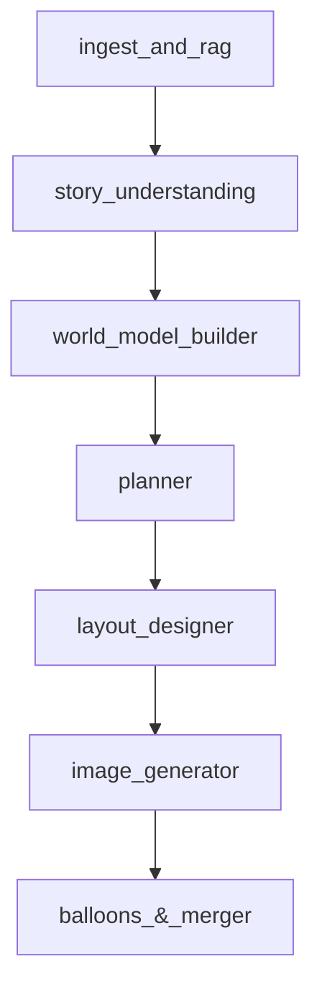

# ComicDraft AI - Orchestration Agent 🤖🎨

Este módulo representa el "Cerebro" de la plataforma ComicDraft. Es un agente de orquestación avanzado encargado de transformar guiones heterogéneos y documentos de referencia en un borrador de cómic estructurado, manteniendo coherencia visual y narrativa.

## 🏗️ Arquitectura del Agente

La orquestación se basa en un grafo de estados cíclico y dirigido (DAG) utilizando **LangGraph**.

### Flujo de Trabajo (Grafo)


## 🧩 Nodos Especializados

Cada nodo en el grafo cumple una función crítica:

1.  **`ingest_and_rag`**: Digiere archivos PDF/DOCX/TXT y los indexa en **ChromaDB**. Extrae el contexto global y las reglas del mundo.
2.  **`story_understanding`**: Realiza un análisis profundo del guion en batches. Extrae resúmenes detallados por página y el "propósito narrativo" de cada viñeta.
3.  **`world_model_builder`**: Construye el "Canon" del proyecto. Identifica personajes y escenarios, asociándolos con imágenes de referencia para asegurar su identidad visual.
4.  **`planner`**: El "Director de Arte". Descompone la narrativa en paneles técnicos, asignando descripciones de escena, personajes presentes y encuadres.
5.  **`layout_designer`**: Define la disposición de los paneles en el lienzo (A4), gestionando el tamaño y posición de cada "bounding box".
6.  **`image_generator`**: El "Artista". Genera imágenes multimodales enriquecidas con el contexto del Canon y el propósito narrativo.
7.  **`balloons_&_merger`**: Ensambla las imágenes finales, añade globos de texto y genera la página completa del cómic.

## 💡 Estrategias de Consistencia Inteligente

Para evitar que los personajes o estilos cambien entre paneles, el agente utiliza una capa de consistencia denominada **Agent Core Knowledge**:

*   **`CanonicalStore`**: Almacena la "Verdad Oficial" del proyecto en AWS S3 (`canon.json`).
*   **`CharacterManager`**: Mantiene los rasgos físicos y referencias visuales de cada personaje. Si un personaje aparece en el Panel 1 y en el 20, el agente consulta este manager para heredar los mismos descriptores.
*   **`StyleManager`**: Normaliza el estilo artístico a partir de guías de estilo o ejemplos, extrayendo tokens visuales (ej: "thick lines", "vaporwave palette") que se inyectan en cada prompt de generación.
*   **`SceneryManager`**: Garantiza que los fondos y escenarios sean recurrentes y reconocibles.

## 🎨 Context Engineering Multimodal

El agente no solo procesa texto, sino que aplica una estrategia de **Ingeniería de Contexto Multimodal** para guiar a los modelos de imagen (LMM):
*   **Prompt Layering**: Combina dinámicamente el estilo global, la descripción de la escena, los rasgos del canon y el propósito narrativo en un único prompt enriquecido.
*   **Vision-to-Image (V2I)**: Inyecta imágenes de referencia (personajes, escenarios) directamente en el contexto del modelo de generación para asegurar que el "fiel de la balanza" visual se mantenga constante.
*   **Image-to-Image (I2I)**: Soporta flujos de edición donde una imagen previa sirve como base estructural para la siguiente, permitiendo retoques precisos y continuidad de pose/acción.

## 🚀 Uso de Agent Core (AWS Bedrock)

Este agente está diseñado para ejecutarse sobre **Amazon Bedrock Agent Core**, permitiendo:
*   **Escalabilidad**: Ejecución serverless mediante contenedores en AWS.
*   **Seguridad**: Gestión de identidad y roles vía IAM.
*   **Observabilidad**: Logs y métricas integradas nativamente.

---

## 🛠️ Guía de Despliegue en AWS (Agent Core)

Para levantar este agente en tu propia instancia de AWS utilizando Agent Core, sigue estos pasos:

### 1. Prerrequisitos
*   Tener instalado el **AWS CLI** y configurado con tus credenciales.
*   Crear un queue en el servicio **Amazon SQS** y obtener su URL.
*   Instalar dependencias:
```bash
cd agent/
uv sync
```

### 2. Configuración
Activar entorno virtual
```bash
.venv/bin/activate
```

Crear proyecto AgentCore y configurar el Wizard.
```bash
agentcore create
```

Se generará el archivo `.bedrock_agentcore.yaml`.

### Comandos de Despliegue

Desde la raíz de la carpeta `agent/`, ejecuta:

```bash
# 1. Desplegar el agente en AWS
agentcore launch --env PORT=8001 --env DEBUG=True --env OPENAI_API_KEY=your_openai_api_key --env AWS_ACCESS_KEY_ID=your_access_key_id --env AWS_SECRET_ACCESS_KEY=your_secret_access_key --env AWS_REGION=your_region_name --env AWS_STORAGE_BUCKET_NAME=your_bucket_name --env GOOGLE_API_KEY=your_google_api_key --env OPENAI_MODEL_ID=gpt-4o-mini --env GEMINI_MODEL_ID_TEXT=gemini-2.5-flash --env GEMINI_MODEL_ID_IMAGES=gemini-2.5-flash-image --env IMAGE_GEN_PROVIDER=gemini --env CHROMA_PERSIST_DIR=./data/chroma --env PROJECT_DATA_DIR=./data/projects --env AWS_SQS_QUEUE_URL=your_sqs_queue_url --env LANGCHAIN_TRACING_V2=true --env LANGCHAIN_API_KEY=your_langsmith_api_key --env LANGCHAIN_PROJECT=draft-comic
```
